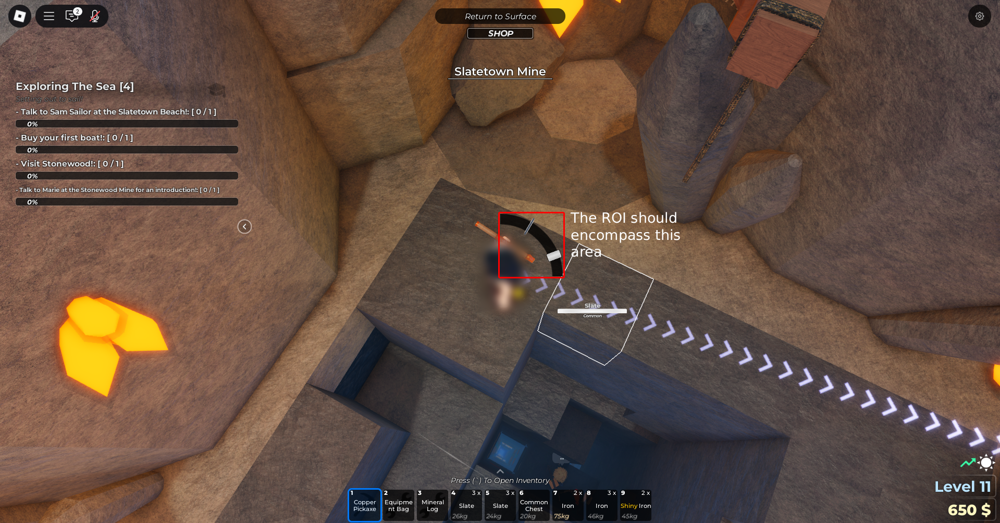

<div align="center">
<h1>Mine Tool</h1>
</div>

# Overview

Mine Tool is currently a Proof of Concept (PoC) Python script designed for partially automating the mining minigame in the Roblox game ["Mine"](https://www.roblox.com/games/115694170181074). This tool utilizes image processing with OpenCV and GUI control with Tkinter to provide real-time visual debugging and automated mouse actions.

https://github.com/user-attachments/assets/b9b0077b-f285-475f-a4c0-fb29c43b4072

# Setup Instructions

## Requirements

- Python 3.x
- Python packages listed in requirements.txt

## Running from Source

```bash
git clone https://github.com/AlinaWan/mine-tool.git
cd mine-tool
````

Install dependencies:

```bash
pip install -r requirements.txt
```

Run the application:

```bash
python app.py
```

# Usage

## Initial Setup (First Run)

1. Run the script once. It will automatically generate a `config.ini` file in the same directory.

2. Edit `config.ini`: Open `config.ini` in a text editor.

3. **Define ROI (Selection Zone):**
   Adjust `ROI_X1`, `ROI_Y1`, `ROI_X2`, `ROI_Y2` to accurately encompass the entire area where the mini-game's curved bar and moving line appear. This is crucial for accurate detection. Use a screenshot tool to get these pixel coordinates.

4. **Calibrate Colors:**
   Adjust `HEX_GREY` and `HEX_WHITE` to match the exact hexadecimal colors of the moving grey line and the target white area in your game. Adjust `COLOR_TOLERANCE` to fine-tune how strictly these colors are matched.

5. **Set Thresholds:**
   Adjust `MIDDLE_THRESHOLD` for the precision required for the grey line to be considered "in the middle" of the white area.

6. **Set Cooldown:**
   Configure `CLICK_COOLDOWN_DURATION` to set a delay after a mouse release, preventing rapid re-clicks.

7. Save `config.ini` and re-run the script.

### Example ROI Setup

An example ROI (Region of Interest) image is shown below. The default values are configured for:

- Screen resolution: **1920×1080**  
- Operating System: **Windows 11**  
- Roblox running in **windowed mode**



> [!NOTE]
> If your setup differs (different resolution, OS, or fullscreen/window mode), you must adjust the ROI coordinates in `config.ini` accordingly for accurate detection.

## Start Mining

Once the script is running, manually click and hold your left mouse button on the desired in-game element (e.g., a block you want to mine) to initiate the mini-game.

The program will automatically release the left mouse button when the moving grey line intersects the target white area on the curved bar, completing the mini-game action.

## Visual Debugging

The script will open several small debug windows that stay on top:

* **Detected Elements (Live):** Shows the active ROI with detected grey line, white area, and curved bar, along with their centroids and the line's rotation. This is your primary visual feedback.
* **Grey Line Mask:** A black and white view showing only the pixels detected as part of the grey line.
* **White Area Mask:** A black and white view showing only the pixels detected as part of the white area.
* **Curved Bar Mask (Dark Area):** A black and white view showing the detected curved bar's area.

Use these windows to verify that the script is accurately identifying the elements based on your `config.ini` settings.

## Stop the Script

Press the **Esc** key on your keyboard at any time to gracefully stop the script and close all debug windows (or press Ctrl+C in the console window).

# Configuration (`config.ini`)

This script uses a `config.ini` file to manage its settings, making it easy to adjust parameters without editing the Python code directly. If `config.ini` is not found, the script will automatically create one with default values in the same directory.

## How to Edit `config.ini`

1. Run the script once: This will generate the `config.ini` file if it doesn't already exist.

2. Open `config.ini`: Use any text editor (like Notepad, VS Code, Sublime Text, etc.) to open the `config.ini` file in the same directory as your Python script.

3. Adjust Values: Modify the values to the right of the equals sign (`=`).

4. Save and Rerun: Save the `config.ini` file and then restart your Python script to apply the changes.

## Configuration Variables Explained

### \[Detection] Section

#### ROI\_X1, ROI\_Y1, ROI\_X2, ROI\_Y2

* **What they are:** These four values define the Region of Interest (ROI) on your screen in pixel coordinates. This is the rectangular area the script will monitor for the game's mini-game elements.
* **How to set:**

  * `ROI_X1`: The X-coordinate (horizontal) of the top-left corner of your ROI.
  * `ROI_Y1`: The Y-coordinate (vertical) of the top-left corner of your ROI.
  * `ROI_X2`: The X-coordinate (horizontal) of the bottom-right corner of your ROI.
  * `ROI_Y2`: The Y-coordinate (vertical) of the bottom-right corner of your ROI.
* **Effect:** A precisely defined ROI improves performance and reduces false detections by focusing the image processing only on the relevant part of the screen.
* **Tip:** Use a screenshot tool (like Windows Snipping Tool, Greenshot, or macOS built-in screenshot tools) to easily get these pixel coordinates.

#### HEX\_GREY

* **What it is:** The hexadecimal color code for the grey line you want to detect.
* **How to set:** Find the exact hex color of the grey line in your game. Tools like digital color pickers (often found in image editing software) can help you get this value (e.g., `#485163`).
* **Effect:** Determines which pixels are identified as part of the grey line.

#### HEX\_WHITE

* **What it is:** The hexadecimal color code for the white area on the curved bar.
* **How to set:** Similar to `HEX_GREY`, find the exact hex color of the white area.
* **Effect:** Determines which pixels are identified as part of the white target area.

#### COLOR\_TOLERANCE

* **What it is:** An integer value that defines how much variation in color is allowed when detecting `HEX_GREY` and `HEX_WHITE`.
* **How to set:**

  * A lower value (e.g., 5-10) means the script will only detect pixels that are very close to the exact `HEX_GREY` or `HEX_WHITE` color. This is good if colors are very consistent.
  * A higher value (e.g., 20-30 or more) allows for more variation, useful if lighting or game effects cause the colors to shift slightly.
* **Effect:** Directly impacts the accuracy of the grey line and white area detection. Too low, and it might miss the target; too high, and it might detect unintended elements.
* **Tip:** Use the debug masks (the Grey Line Mask and White Area Mask windows) to fine-tune this. When the masks accurately highlight only the target color, your tolerance is good.

#### MIDDLE\_THRESHOLD

* **What it is:** An integer value (in pixels) that determines how close the center of the grey line must be to the center of the white area for the mouse button to be released.
* **How to set:**

  * A lower value (e.g., 5-10) means the grey line needs to be very precisely in the middle.
  * A higher value (e.g., 15-25) allows for a larger "hitbox" around the middle.
* **Effect:** Controls the precision required for the automated mouse release.

### \[Automation] Section

#### CLICK\_COOLDOWN\_DURATION

* **What it is:** A floating-point value representing the time (in seconds) that the script will wait after releasing the mouse button before it can release it again.
* **How to set:**
  If set to `0.5`, the script will release the mouse, then wait for 0.5 seconds without releasing the mouse again, before becoming ready for another release.
  Adjust based on the timing needed in your mini-game.
* **Effect:** Prevents rapid, unintended multiple clicks and allows for a "rest" period. During this cooldown, the visual debugging windows will continue to update, as the core processing loop is not blocked.

# Notes

* This tool detects elements based on their colors using the reference colors provided in `config.ini`. Adjust the color tolerance for best results depending on your screen and lighting.
* The script requires you to manually click and hold the mouse button to start the mini-game. It will only automate the release action.
* The debug windows are designed to stay on top, but extreme system resource usage or certain full-screen exclusive applications might still cause them to hide or flicker.

# Troubleshooting

* **The program crashes when I switch focus to another application:**
  This issue should be resolved by the multithreaded design. If it persists, ensure your Python environment and dependencies are correctly installed.

* **The debug windows appear to "freeze" briefly after a mouse click:**
  This is expected behavior as the script enters a `CLICK_COOLDOWN_DURATION`. During this time, the mouse will not be released again, but the GUI and tracking continue. Adjust the `CLICK_COOLDOWN_DURATION` in `config.ini` to a shorter value if desired.

* **Nothing is being detected at all:**
  Increase the `COLOR_TOLERANCE` slider in `config.ini`. The app might be too strict in matching colors, especially if your screen has unusual brightness or color settings.

* **Wrong elements are being detected or multiple parts of the same element are detected separately:**
  Decrease the `COLOR_TOLERANCE` in `config.ini`. It’s likely the app is being too lenient and is matching different colors as the same element. You might also need to refine your ROI to exclude irrelevant parts of the screen.

# End Notes

Mine Tool is a Proof of Concept project. Its functionality is limited to automating the mouse release based on visual cues. It is not intended for complex automation and may require manual adjustments for different game interfaces or system environments.

# License

Mine Tool and this repository are licensed under the [Mozilla Public License 2.0](LICENSE).